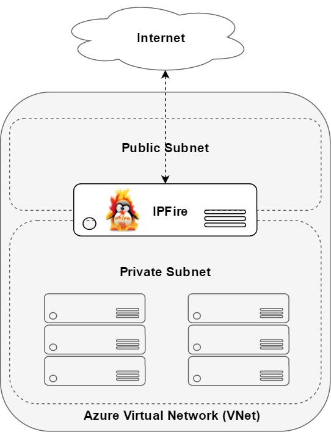
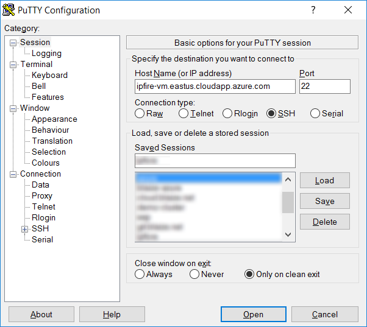
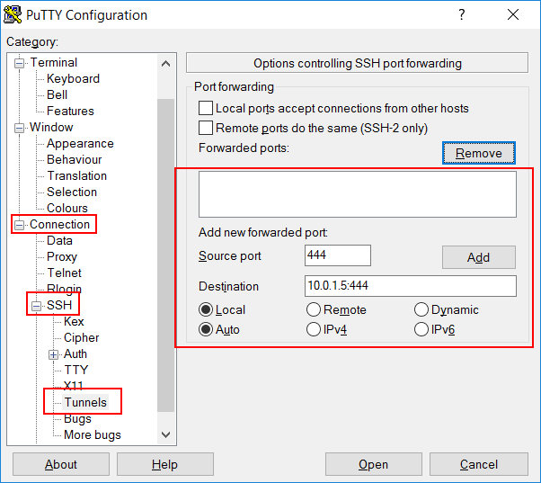
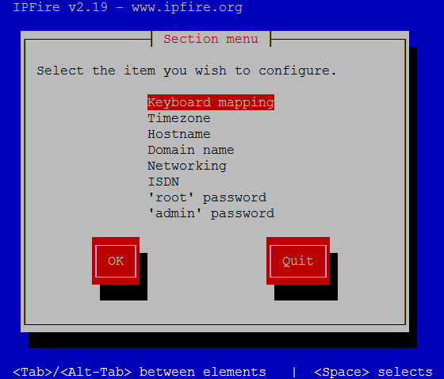

IPFire on Azure
====

IPFire is a nimble, Linux based firewall that is widely used by enthusiasts and organizations alike. IPFire doesn't style itself as an enterprise class solution, being primarily geared at SOHO and medium-sized organizations. It's compact size however makes it ideal for running edge protection as a virtual appliance on a cloud-based virtual data center as well as a way to control access to resources in the VDC.

This little project started grew out of a desire to get IPFire on Azure after having successfully got Untangle (another excellent firewall distro) to run on Azure. IPFire on Azure enables networks to have more fine grained control over network policy than that which is offered with standard network components on Azure like NSG's. The typical network topology on Azure is to carve up a Virtual Network into subnets and use a firewall or sort to control access between the subnets. The configurration in this template is a fairly standard set up for networks of all types with a public subnet with an edge device that controls access to a private subnet. 



Pound-for-pound, IPFire offers a many of the same features commercial firewalls offer at no cost because everything in on IPFire is open source including content filtering, road-warrior VPN (OpenVPN or IPSec), site-to-site VPN (OpenVPN or IPSec), intrusion detection, DHCP services, DNS services, integrated dynamic DNS, firewall, geoblocking, reverse proxying (w/ HAProxy), spam filtering, antivirus, file services, QoS, NTP and much more...


## Prerequisites

To setup IPFire on Azure, you'll need:

* A prepped VHD image. You can download one here or [prepare it yourself](prep.md). 
* PowerShell and the [Azure Powershell](https://docs.microsoft.com/en-us/powershell/azure/install-azurerm-ps?view=azurermps-3.8.0) to be installed
* An SSH client ([Putty](http://www.chiark.greenend.org.uk/~sgtatham/putty/latest.html) for Windows)
* An internet browser
* An Azure Subscription.
* The [Azure Resource Manger (ARM) Template (ipfire.json)](https://raw.githubusercontent.com/theonemule/ipfire-azure/master/ipfire.json) and the [Pparameters file (ipfire.parameters.json)](https://raw.githubusercontent.com/theonemule/ipfire-azure/master/ipfire.parameters.json).


## Setting up IPFire on Azure


1. Logon to Azure. This will launch a dialog to prompt for your Azure credentials

	````
	Login-AzureRmAccount
	````

1. Create a new resource group. The **Name** parameter is the name of the resource group to create, and the **Location** is the [Azure Regions](https://azure.microsoft.com/en-us/regions/) you want to host IPFire in.

	````
	New-AzureRmResourceGroup -Name "ipfire" -Location "East US"
	````

1. Create a storage account. The **ResourceGroupName** and **Location** should match the resource group you just created. Select *Standard_LRS* for **SkuName** and set **Kind** to *Storage*. If you plan on running a very busy IPFire firewall, you may want to change the SkuName to *Premium_LRS* as it is much faster. The **Name** of the storage account will have to be unique.

	````
	New-AzureRmStorageAccount -ResourceGroupName ipfire -Name youripfire -Location "East US" -SkuName "Standard_LRS" -Kind "Storage"
	````	
	
1. Upload the VHD. Azure will create a hash of the the image then upload it. This may take some time depending on your connection speed and CPU speed of your local machine. Change the name of the after the https:// in **Destination** to match your storage account name. (i.e. https://youripfire.blob....) Make sure the **ResourceGroupName** matches the  name give to the resource group created in Step 2. The LocalFilePath is simply the path to the .vhd file for the IPFire image.

	````
	Add-AzureRmVhd -ResourceGroupName ipfire6 -Destination "https://ipfire.blob.core.windows.net
/vhds/ipfire.vhd" -LocalFilePath "path\to\ipFire.vhd"
	````

	When the upload completes, note the **DestinationUri** for the VHD. This will be needed in the next step.

1. Edit the **ipfire.parameters.json** file. Set the value of **osDiskVhdUri** to the **DestinationUri** for the VHD from Step 4. Set the **vmName** to something unique. This will be part of a URL that is used to connect to IPFire. The **vmSize** is set to *Standard_A1*, which is a single core VM with 1.75 GB of RAM, which is sufficient for more modest loads. Azure has a number of options available for more powerful VM's should the *Standard_A1* not be sufficient. Save the file.

1. Run the ARM Template. Ensure that the path to the **TemplateFile** and the **TemplateParameterFile** are set to the path on your computer and the the **ResourceGroupName** matches the name given in Step 2. This will provision the VM and Azure resources needed to run the VM.

	````
	New-AzureRmResourceGroupDeployment -Name "ipfire" -ResourceGroupName "ipfire"  -Mode Incremental  -TemplateFile path\to\ipfire.json  -TemplateParameterFile \path\to\ipfire.parameters.json  -Force -Verbose
	````

	Pay attention to the output -- it will display an output called **sshCommand**. You can use this command to connect to the VM on Azure if you have an SSH client like on Mac and Linux.

1. For **Mac** or **Linux**: Once the VM starts, you can connect to it with your favorite SSH client. Copy the sshCommand output from **Step 6** and paste it into the terminal. Add **-L  444:10.0.1.5:444** flag between the ssh and the root@. Your command should look something like the following command:

	````
	ssh -L 444:10.0.1.5:444 root@ipfire-vm.eastus.cloudapp.azure.com
	````

1. For **Windows**, Open **Putty**. On the menu on the left, select **Session** and paste in the DNS name for the host portion (ie. ipfire-vm.eastus.cloudapp.azure.com) into **Host Name (or IP Address)**. 

	

	On the left, scroll down and select **Connection** -> **SSH** -> **Tunnels**. In **Source port**, type in *444*. For **Destination**, type in *10.0.1.5:444*. Make sure **Local** is selected, then click **Add**. Click **Open**. Putty will prompt you with *login as*. Enter *root*. Next, enter the password. If you downloaded the image, enter in *password1* for the password.

	

1. Once logged in, run **setup** to change the **'root' passwor**d and **'admin' password**. Do not change any other settings. **Quit** when finished.

	

1. Open a browser and point it https://localhost:444. You may receive a message that the site is not secure. This is OK. Simply click past this. Logon with **admin** and the new password set in **Step 9**.  You may want to change the SSH ports or make other changes to the firewall. Be careful though that you do not cut off access to the firewall by creating a rule that blocks SSH traffic or removing the existing rule that lets it in from the outside.

That's it -- Once you're able to logon, your instance of IPFire is ready to go.


